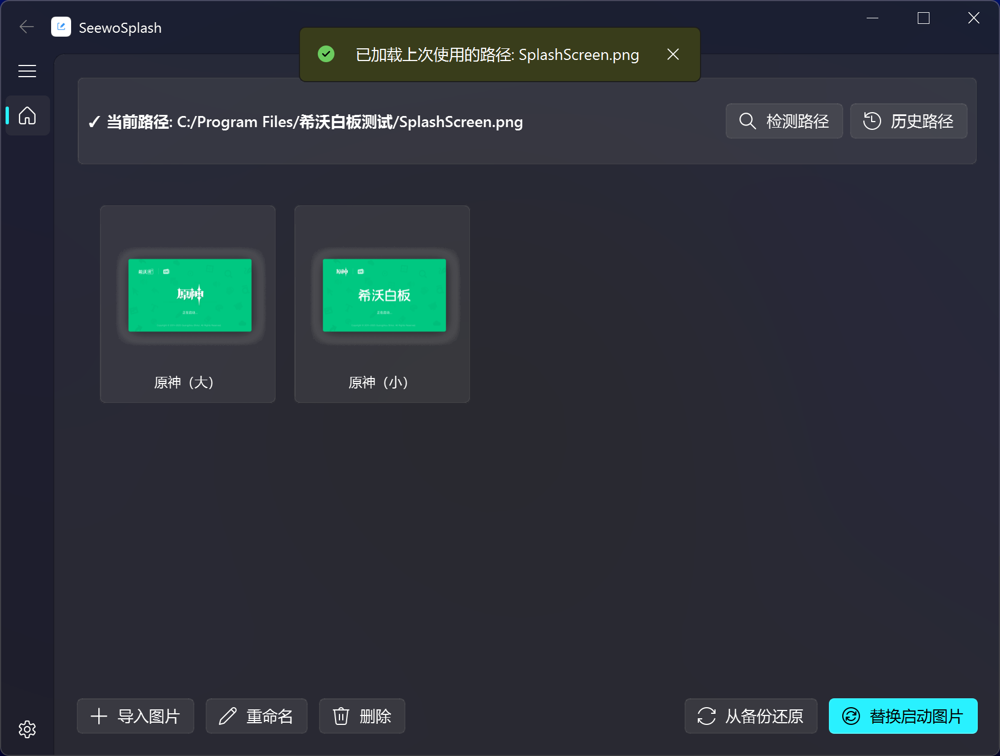
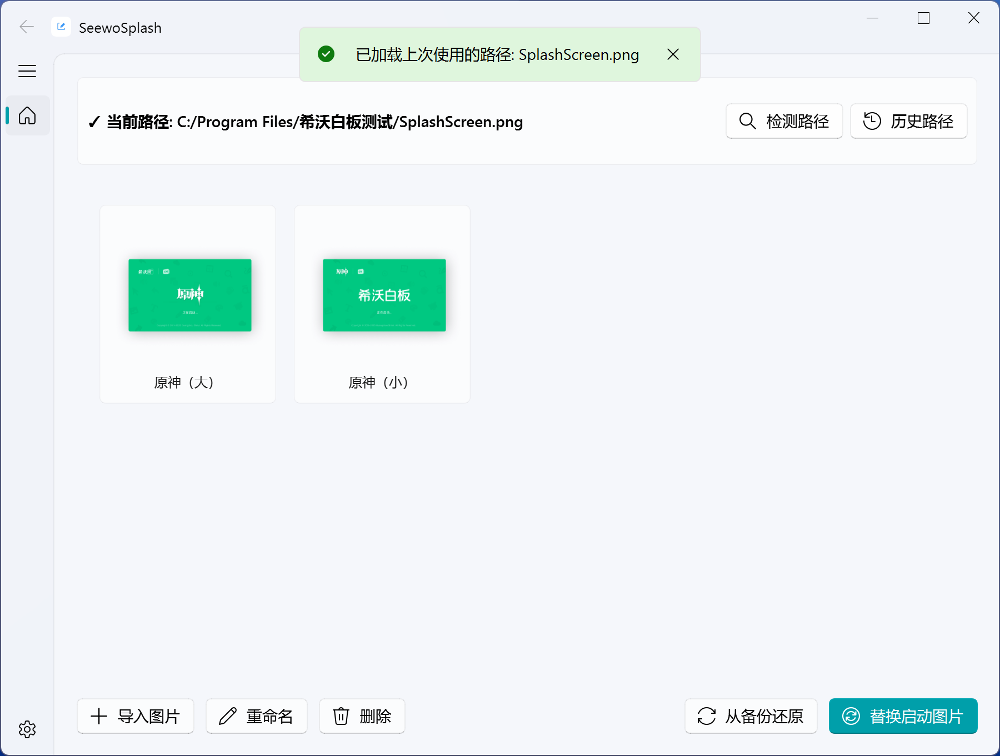

# SeewoSplash - 希沃白板/WPS Office 启动图自定义工具

<div align="center">


一个用于自定义 希沃白板/WPS Office 启动图的简单工具

[功能特性](#功能特性) • [安装使用](#安装使用) • [构建](#构建) • [常见问题](#常见问题) • [许可证](#许可证)

</div>

---

## 简介

SeewoSplash 是一个 Fluent 风格的图形化工具，允许你自定义希沃白板以及 WPS Office 的启动图，告别单调的默认启动图！

### 功能特性

- 🎨 **预设图片** - 内置启动图
- 📁 **自定图片** - 支持导入自己的 PNG 图片
- 🚀 **拖拽操作** - 支持拖拽快速添加图片
- 🔍 **路径检测** - 自动检测 希沃白板/WPS Office 安装路径，支持所有新旧版
- 💾 **自动备份** - 替换前备份原始图片，支持还原
- 🖼️ **图片管理** - 支持重命名、删除自定义图片
- 🔃 **权限管理** - 权限不足时尝试以管理员身份重启
- 🛡️ **防止恢复** - 防止启动图被其他应用还原
- 📱 **用户页面** - 优雅的 Fluent UI 设计
- 💻 **平台兼容** - 支持 Windows、Linux 平台

> [!IMPORTANT]
> 已经过测试的希沃白板版本: `5.1.12.62976` ~ `5.2.4.9242`
> 
> 已经过测试的 WPS Office 版本: `12.1.0.21171` ~ `12.1.0.24034`

### 应用截图

|  深色模式  |  浅色模式  |
|-----------|-----------|
|  |  |
|  |  |

## 安装使用

### 方式一：下载发行版（推荐）

1. 前往 [Releases](https://github.com/fengyec2/custom-seewo-splash-screen/releases) 页面获取正式版（或前往 [Actions](https://github.com/fengyec2/custom-seewo-splash-screen/actions) 页面获取测试版）
2. 下载最新版本的 `SeewoSplash.zip`
3. 解压后运行 `SeewoSplash.exe` 即可使用

> [!NOTE]
> 带有 Full 字样的是支持亚克力效果的版本，与 Lite 版只有这个区别

### 方式二：从源码运行

#### 环境要求

- Python 3.8 +
- Windows 10 + / Linux 操作系统

#### 安装步骤

1. **克隆仓库**

```bash
git clone https://github.com/fengyec2/custom-seewo-splash-screen.git
cd custom-seewo-splash-screen
```

2. **安装依赖**

```bash
pip install -r requirements.txt
```

```bash
# 安装轻量版
pip install PyQt5-Fluent-Widgets

# 安装完整版
pip install "PyQt5-Fluent-Widgets[full]"
```

3. **运行程序**

```bash
python main.py
```

## 构建

如果你想自己构建可执行文件：

```bash
# 安装 PyInstaller
pip install pyinstaller

# 构建
python build.py
```

构建完成后，可执行文件将位于 `dist/` 目录下。

## 使用说明

### 首次使用

1. **启动程序** - 运行 `SeewoSplash.exe`
2. **检测路径** - 点击"检测路径"按钮，程序会自动查找软件安装路径
3. **选择图片** - 从图片列表中选择启动图片
4. **替换** - 点击"替换启动图片"按钮即可

### 导入自定义图片

1. 点击"导入图片"按钮
2. 选择一张 PNG 格式的图片
3. 图片将被自动导入到自定义图片库

### 还原原始图片

如果想恢复原始启动图：

1. 点击"从备份还原"按钮
2. 程序会自动从备份恢复原始图片

## 项目结构

```
custom-seewo-splash-screen/
├── main.py                      # 程序入口
├── requirements.txt             # 依赖列表
├── build.py                     # 构建脚本
├── assets/                      # 资源文件
│   ├── icon.ico                 # 程序图标
│   └── preset/                  # 预设启动图
├── core/                        # 核心功能模块
│   ├── app_info.py              # 应用信息管理
│   ├── config_manager.py        # 配置管理
│   ├── file_protector.py        # 防止图片恢复
│   ├── image_manager.py         # 图片管理
│   └── replacer.py              # 图片替换
├── ui/                          # 用户界面
│   ├── __init__.py
│   ├── main_window.py               # 主窗口
│   ├── settings.py                  # 设置页面
│   ├── controllers/                 # 控制器层
│   │   ├── __init__.py
│   │   ├── path_controller.py       # 路径管理控制器
│   │   ├── image_controller.py      # 图片操作控制器
│   │   └── permission_controller.py # 权限处理控制器
│   ├── widgets/                 # UI 组件
│   │   ├── __init__.py
│   │   ├── path_card.py         # 路径信息卡片
│   │   ├── image_list.py        # 图片列表组件
│   │   └── action_bar.py        # 操作按钮栏
│   └── dialogs/                     # 对话框
│       ├── __init__.py
│       ├── message_helper.py        # 消息提示辅助类
│       └── path_history_dialog.py   # 历史路径对话框
└── utils/                       # 工具模块
    ├── admin_helper.py          # 管理员权限管理
    ├── resource_path.py         # 资源路径管理
    ├── system_theme.py          # 主题色管理
    └── path_detector.py         # 路径检测
```

## 常见问题

### Q: 为什么检测不到希沃白板/WPS 路径？

A: 请确保：
1. 希沃白板已正确安装
2. 程序具有管理员权限
3. 可以尝试手动选择路径
4. 仅支持新版本的 WPS，旧版的启动图不是图片

### Q: 替换后图片没有变化？

A: 请尝试：
1. 完全退出应用后重新打开
2. 检查是否替换成功（查看浮窗提示）
3. 使用"从备份还原"后重新替换

### Q: 可以恢复到原始图片吗？

A: 可以！程序在首次替换时会自动备份原始图片，点击"从备份还原"即可恢复

### Q: 为什么替换后在文件资源管理器中找不到启动图了？

A: 为防止启动图被其他应用还原，程序会尝试为其设置"只读+系统+隐藏"属性。如需恢复，点击"从备份还原"即可

## 贡献

欢迎提交 Issue 和 Pull Request！

1. Fork 本仓库
2. 创建特性分支 (`git checkout -b feature/AmazingFeature`)
3. 提交更改 (`git commit -m 'Add some AmazingFeature'`)
4. 推送到分支 (`git push origin feature/AmazingFeature`)
5. 提交 Pull Request

## 许可证

本项目采用 GNU General Public License v3.0 许可证 - 详见 [LICENSE](LICENSE)

## 联系方式

- Issue: [提交问题](https://github.com/fengyec2/custom-seewo-splash-screen/issues)

---

<div align="center">

**如果这个项目对你有帮助，请给一个 ⭐ Star！**

Made with ❤️ by [fengyec2](https://github.com/fengyec2)

</div>